# Personal Portfolio Project

The link to my portfolio website may be found at the following link: https://genmauger.netlify.com/

## Index

1. Problem
2. MVP
3. Research
4. Pinterest/Mood board
5. Figma
6. Coding  
7. Going Live
8. Future Changes

## 1. Problem

In completing this project, I hoped to solve a few problems:
- As a junior developer, how do I make my presence known to potential clients and employers?
- How do I present my website in a way that is succinct and to the point? Websites are evaluated quickly, information should be presented in a way that is easy to evaluate and consume.
- How do I want to be viewed by my audience? What is the best way to market myself to potential clients to achieve this?

## 2. Minimal Viable Product

The MVP for this product would be to at least create a static website that closely resembles my final design in Figma. Beyond that, I will be using flexbox to add responsiveness to my website, and to make all content easily viewable on phone, desktop, and tablet. Finally, I will be using some transitions and keyframes to make my website feel more interactive and dynamic. 

## 3. Research

Research and planning were easily the most important parts of this project for me. Once I had completed both a decided on my final design, coding my website was (besides a couple minor hitches), a fairly straightforward process. 

The first step in my research was to think of themes that would provide inspiration for my color palette. I had a few ideas for this, ranging from the landscape I was surrounded by growing up, calming pastel colors, and bright hues found in city street art. The themes I considered included:

- Country landscape
- Inner city/urban areas (greys mixed with bright, vibrant colors)
- Gardens - both green and drought-resistant (the pastel colors on various cacti provided some great inspiration)
- Minimalist building designs, good use of white space

## 4. Pinterest/Mood Boards

I found Pinterest to be an incredibly useful tool in generating visual inspiration for my website. I ended up making several Pinterest boards that I could draw inspiration from. I found being able to easily view groups of images side by side, and extract similar colors, a very helpful process. I also created a board for different font families, and a Pinterest board solely for logo design. Below is a link to some of the pictures I was drawing inspiration from:

Pastels: 

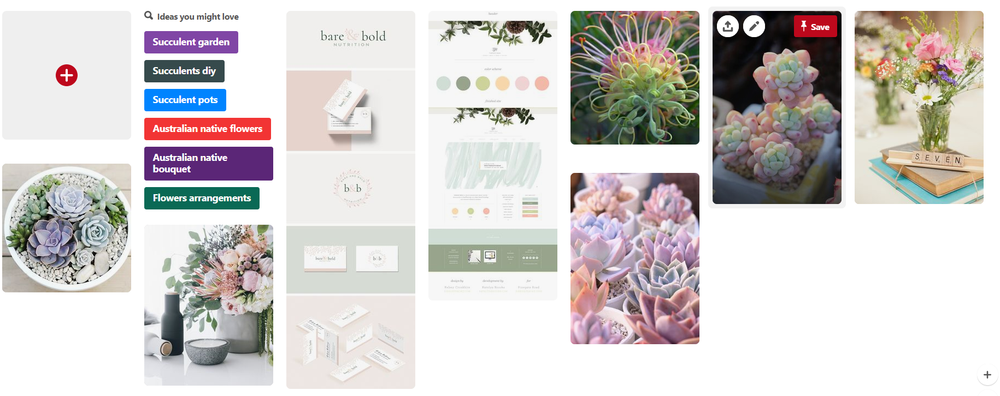!

I found that I really enjoyed the light, softer colors. They were easy on the eye. I also felt they went together a lot more intuitively than 'bold' or stronger colors. Nevertheless, I was also interested in seeing if I could possibly incopororate some strong, bold colors into my design. I found I was also drawn to very minimalist designs, also with soft colors, but also good use of white space to give objects or elements room to breathe.

Bold colors:

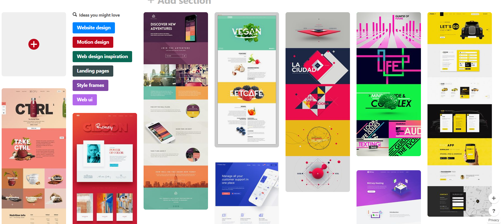

I loved these websites, but even after extracting color palettes from the images, I was unsure as to how i would incoporate bold colors like these into my website. 

As I mentioned above, one of the other inspirations I was considering was classic country landscape. I felt any colors drawn from this would be a good choice. I grew up in the country, and felt that a palette created from this would have the added benefit of carrying personal meaning. Below are some of the images I was considering:

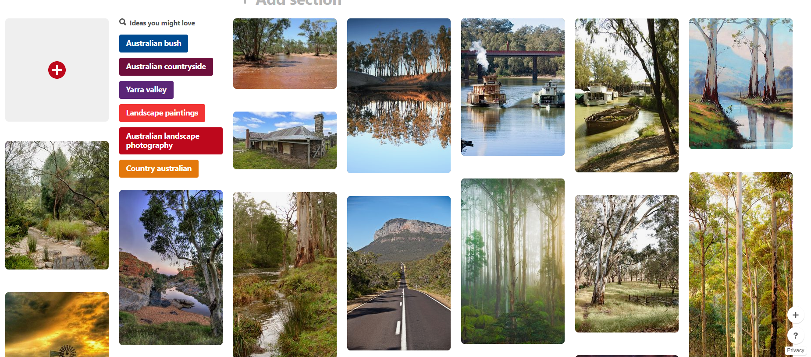

Below are images drawn from both my logo and font Pinterest boards:

Fonts:
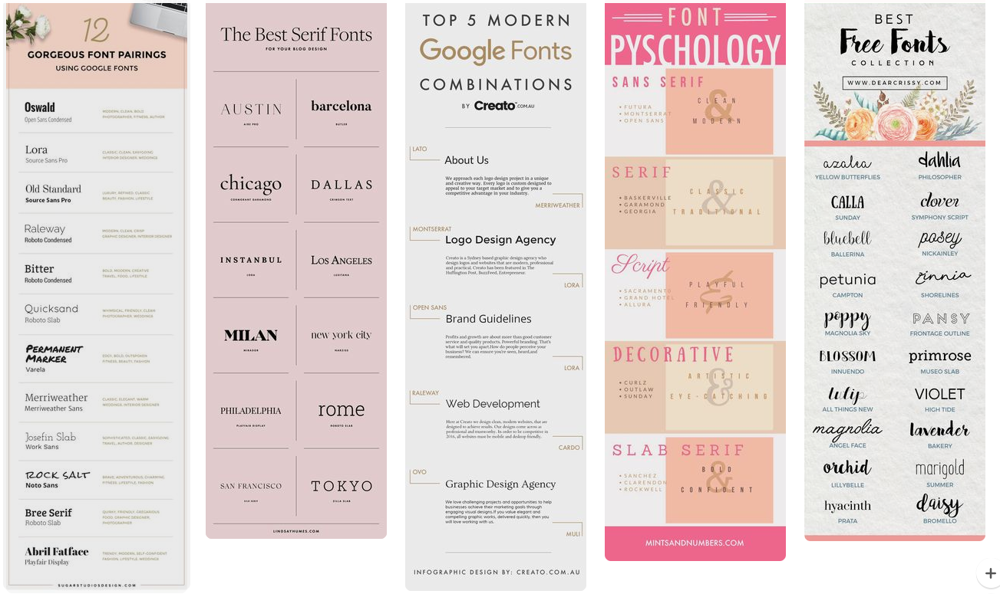

Logos:
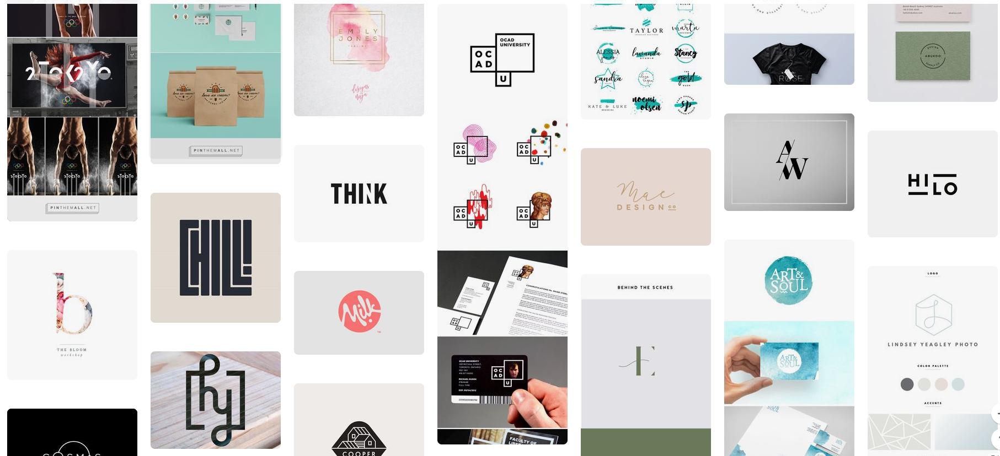

For future reference, and for anyone who is interested, I am including links to all Pinterest boards I used in this project:

Bold colors: https://www.pinterest.com.au/genevieve_mauger/bold-colors/
Pastels: https://www.pinterest.com.au/genevieve_mauger/pastels/
Graffiti/Urban: https://www.pinterest.com.au/genevieve_mauger/grafitti/
Gardens: https://www.pinterest.com.au/genevieve_mauger/japanese-gardens/
Minimalist: https://www.pinterest.com.au/genevieve_mauger/minimalist/
Country Victoria: https://www.pinterest.com.au/genevieve_mauger/country-victoria/
Landscape: https://www.pinterest.com.au/genevieve_mauger/dry-landscape/

## 5. Figma

At this point I had pretty much narrowed my design choices down to two color schemes. It was a pity they were complete opposites:
1. Pastels
2. Bold colors

The best step for me at this point was to actually start designing my website in Figma. I started off with a pastel design. After viewing the colors on my pastel Pinterest board, I decided that I would like to use both blue and pinky/brown as my main colors, with a neutral white as a highlight. However, although I had an idea of the colors I wanted to use, I still had little idea of how I should combine these colors with other page elements to create an effective website. With this in mind, I began searching for examples of other pastel-inspired websites. I found a few, and, pinning them to the top of my Figma board, I began to design:

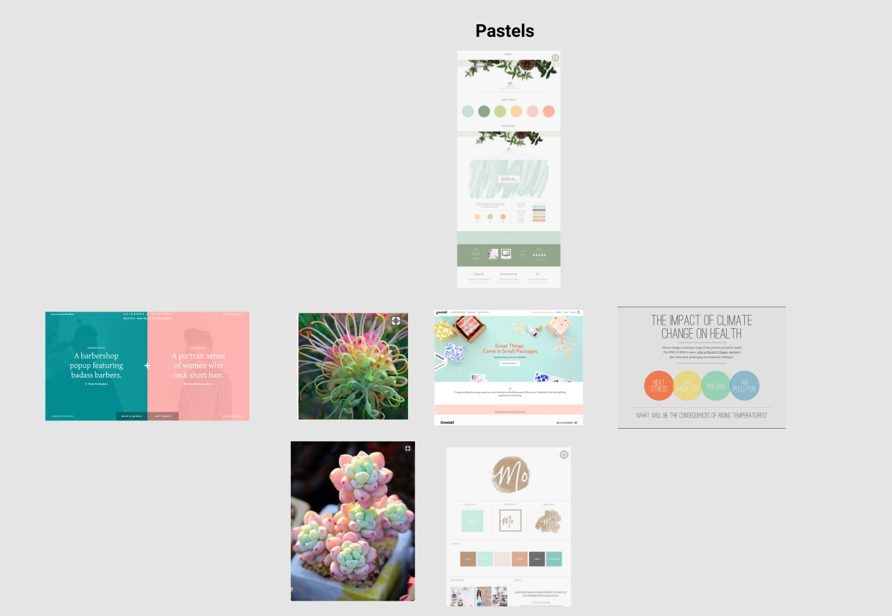
inspiration

I was inpsired by one website in particular, and began using that particular color scheme with circles and squares to give it texture:

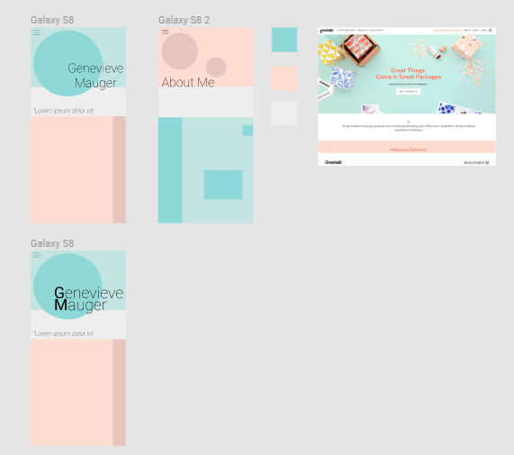

I was also inspired by another pastel-style website that I believe made great use of a wide range of colors, without appearing too messy. I created a few designs based off this website as well:

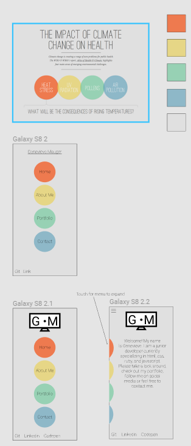

However, although I felt this design looked great, in the end, I felt that it was too similar to the original website design. I was also having a hard time imagining where I could take the design. In the end I abandoned that design. 

I was still interested in potentially creating a website with very bold colors, and felt I should at least give designing one a shot. I created a color palette from this website:

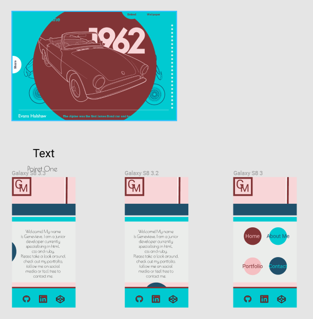

and set about making some designs. I did really enjoy the color palette, but it was very strong. I also felt I wasn't doing the colors themsleves justice. My design felt very constrained. With this in mind, I returned to my original colors. 

My main concern with these colors was that they were just too soft. I was concerned anything I did with them would simply be washed out. I felt since my colors were so light, using black text at least, was a necessity, for some contrast. I continued to experiement with placement of the colors, and ended up with the following designs, for desktop and mobile:

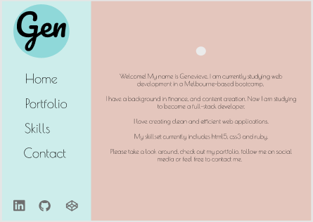

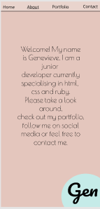

I really liked both these designs. I intended to keep the design fairly simple. This was partly because I was working to a deadline, and wanted to make sure I could deliver on MVP, and partly because, I was a fan of simple, minimalist designs. I was also happy to use a darker version of the pink/brown I had chosen earlier. I felt this gave my design a bit more strength. 

The final colors I chose were:

Blue: #8FD8D9

Pink/Brown: #FEDCD2

Neutral white: #EFEEEE

I felt that just using blue and brown as static colors could be a little boring for the user, so I introduce a gradually ligtening gradient on the desktop site. On my mobile site, I had the vertical nav, transform into a brown top nav. To add a little more texture to the mobile site, I also used a gradient, however, this gradient moved through my chosen colors, brown, neutral white, and blue. 

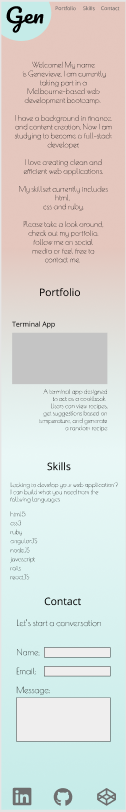

I was happy with my design, it was time to code. 

## 6. Coding 
Coding was a very mixed process for me. However, I do believe that it got easier the further I went along. Some of the major issues I ran into along the way included:

- Making my vertcial nav in desktop view, collapse to a horizontal, fixed nav in mobile view. This was eventually solved with a media query, but caused me some problems in the meantime. 

- I felt that media query necessitated the use of media queries for many other elements. If I had used a fixed top nav for both desktop and mobile, resizing would have been much easier. However, I wanted to recreate a specific design that and this seemed to be the simplest way to accomplish it. 

- I used flexbox for mobile resposiveness. However, I ran into quite a few issues with content overflowing from divs when being resized. i am considering redoing my wesbite in css grid in future, as I feel that most of my content would fit quite neatly into a grid system. 

- A myriad of smaller resizing, aligning, anf sizing issues. 

I felt that by the end of the project, I had a MUCH better grasp on how flexbox worked, as well as parent-child div relationships. 

 ## 7. Going Live

 I set my wesbite to go live through netlify. My website address is: https://genmauger.netlify.com/ The process itself was very simple. The only thing left to do after that was to set up my a working contact form on my wesbite. 

 ## 8. Future Changes

 There are a few changes I would like to make to my wesbite in future:

 - Get a professional photo taken to use on my wesbite
 - Reduce my website's reliance on media query breakpoints
 - Look into possibly redesigning my wesbite in css grid
 - Make my website backwards compatible with older browsers - I haven't done any work on this yet